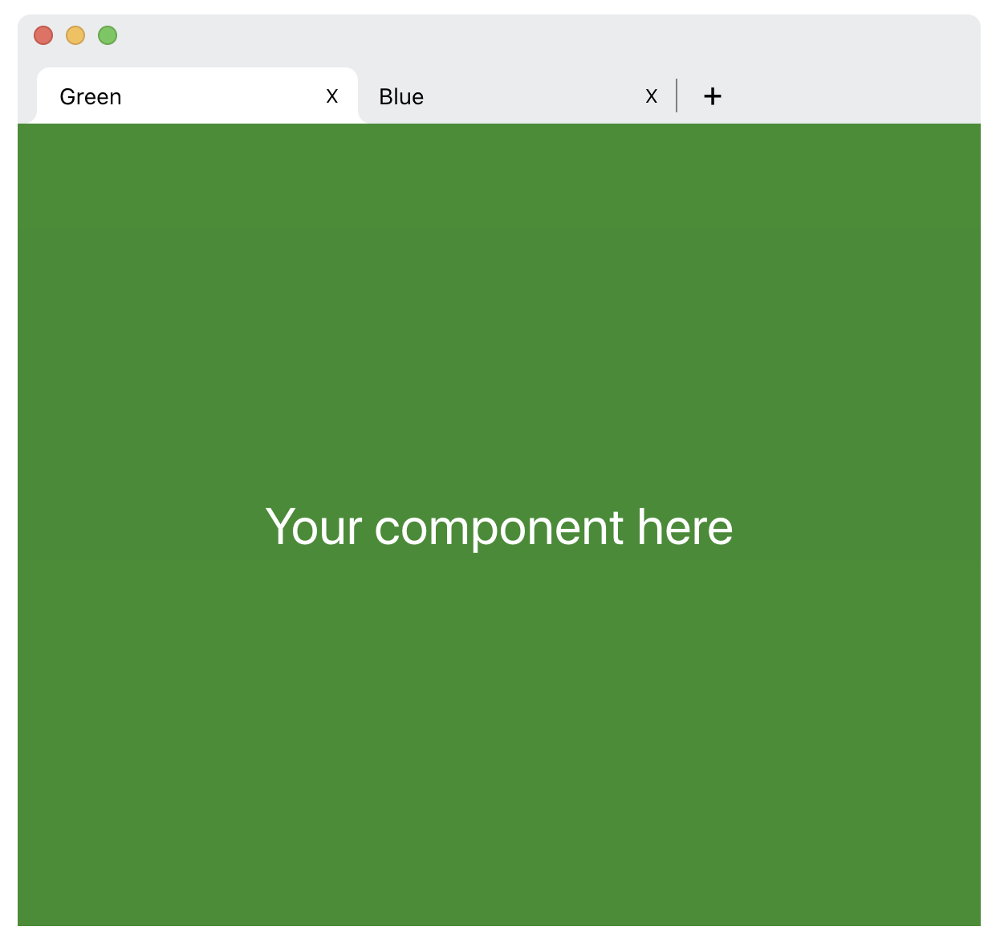
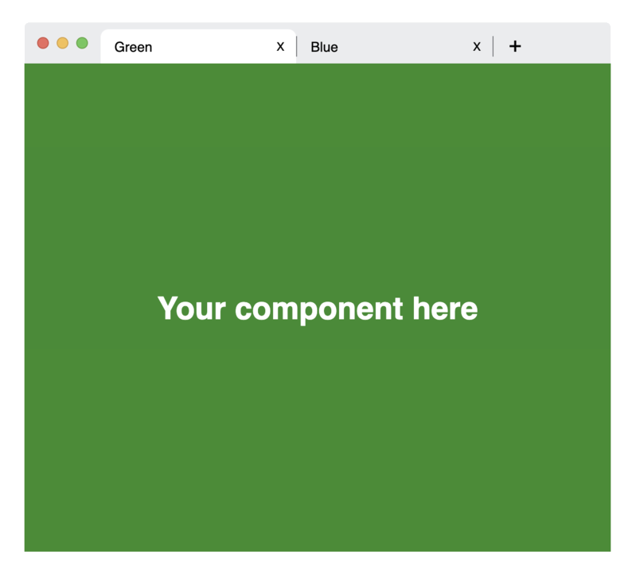
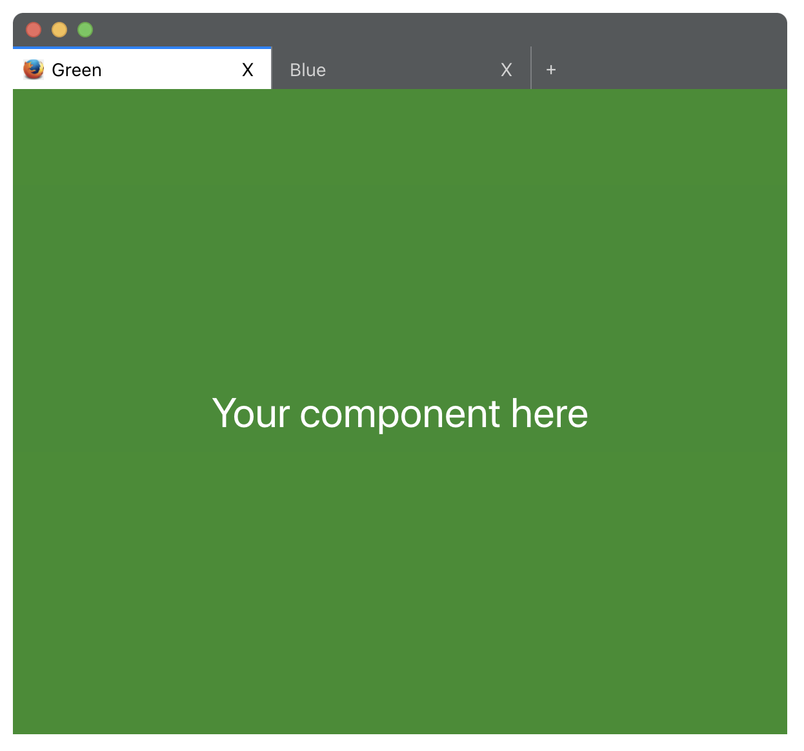
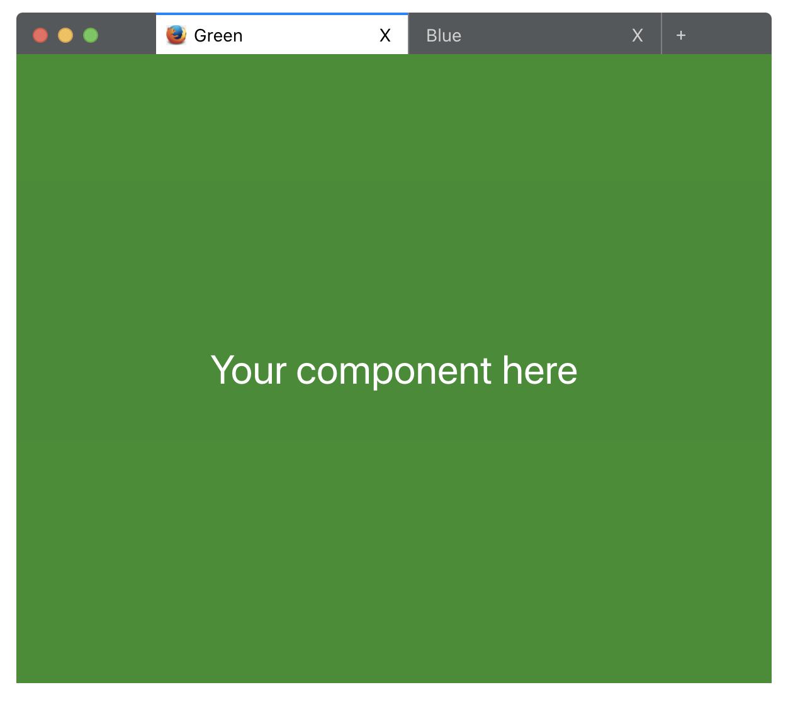
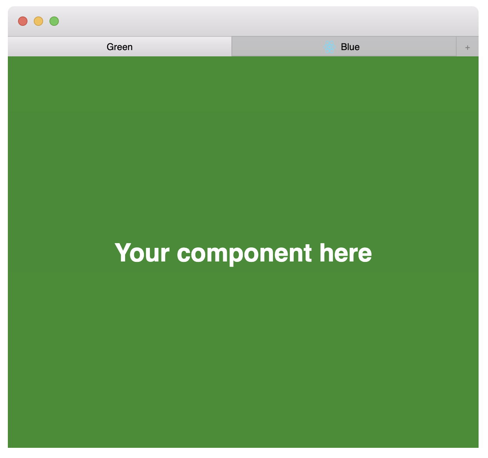

# react-browser-ui

> use browser ui components inside your app!

[](https://www.npmjs.com/package/react-browser-ui) [](https://standardjs.com)

### Demo: https://react-browser-ui.netlify.app/

Chrome (showHeader = true)  | Chrome (showHeader = false) 
:-------------------------:|:-------------------------:
 |  
Firefox (showHeader = true) | Firefox (showHeader = false)
 | 
Safari |
 |

## Install

```bash
npm install --save react-browser-ui
```

## Usage

### Chrome Example
```jsx
import React from 'react'
import Browser, { Chrome } from 'react-browser-ui'

const { Tab, Divider, AddButton } = Chrome

export default function ChromeExample ({ showHeader = false }) {
  const tabEnd = (
    <React.Fragment>
      <Divider />
      <AddButton />
    </React.Fragment>
  )
  return (
    <div style={{ width: 600, height: 500 }}>
      <Browser
        type={'chrome'}
        showHeader={showHeader}
        activeTabKey={'green'}
        tabEnd={tabEnd}>
        <Tab key={'green'} imageUrl={''} imageAlt={'green tab image'} title={'Green'}>
          <div style={{ backgroundColor: 'green', height: '100%', width: '100%', opacity: 0.9, display: 'flex', justifyContent: 'center', alignItems: 'center' }}>
            <h1 style={{ color: 'white', margin: 0 }}>{'Your component here'}</h1>
          </div>
        </Tab>
        <Tab key={'blue'} imageAlt={'blue tab image'} title={'Blue'}>
          <div style={{ backgroundColor: 'green', height: '100%', width: '100%', opacity: 0.9, display: 'flex', justifyContent: 'center', alignItems: 'center' }}>
            <h1 style={{ color: 'white', margin: 0 }}>{'Your component here'}</h1>
          </div>
        </Tab>
      </Browser>
    </div>
  )
}
```

### Firefox Example
```jsx
import React from 'react'
import Browser, { Firefox } from 'react-browser-ui'

const { Tab, Divider, AddButton } = Firefox

export default function FirefoxExample () {
  const tabEnd = (
    <React.Fragment>
      <Divider />
      <AddButton />
    </React.Fragment>
  )
  return (
    <div style={{ width: 600, height: 500 }}>
      <Browser
        type={'firefox'}
        showHeader={false}
        activeTabKey={'green'}
        tabEnd={tabEnd}>
        <Tab key={'green'} imageAlt={'green tab image'} title={'Green'}>
          <div style={{ backgroundColor: 'green', height: '100%', width: '100%', opacity: 0.9, display: 'flex', justifyContent: 'center', alignItems: 'center' }}>
            <h1 style={{ color: 'white', margin: 0 }}>{'Your component here'}</h1>
          </div>
        </Tab>
        <Tab key={'blue'} imageUrl={''} imageAlt={'blue tab image'} title={'Blue'}>
          <div style={{ backgroundColor: 'green', height: '100%', width: '100%', opacity: 0.9, display: 'flex', justifyContent: 'center', alignItems: 'center' }}>
            <h1 style={{ color: 'white', margin: 0 }}>{'Your component here'}</h1>
          </div>
        </Tab>
      </Browser>
    </div>
  )
}
```

### Safari Example
```jsx
import React from 'react'
import Browser, { Safari } from 'react-browser-ui'

const { Tab, Divider, AddButton } = Safari

export default function SafariExample () {
  const tabEnd = (
    <React.Fragment>
      <Divider />
      <AddButton />
    </React.Fragment>
  )
  return (
    <div style={{ width: 600, height: 500 }}>
      <Browser
        type={'safari'}
        showHeader={false}
        activeTabKey={'green'}
        tabEnd={tabEnd}>
        <Tab key={'green'} imageUrl={''} imageAlt={'green tab image'} title={'Green'}>
          <div style={{ backgroundColor: 'green', height: '100%', width: '100%', opacity: 0.9, display: 'flex', justifyContent: 'center', alignItems: 'center' }}>
            <h1 style={{ color: 'white', margin: 0 }}>{'Your component here'}</h1>
          </div>
        </Tab>
        <Tab key={'blue'} imageUrl={''} imageAlt={'blue tab image'} title={'Blue'}>
          <div style={{ backgroundColor: 'green', height: '100%', width: '100%', opacity: 0.9, display: 'flex', justifyContent: 'center', alignItems: 'center' }}>
            <h1 style={{ color: 'white', margin: 0 }}>{'Your component here'}</h1>
          </div>
        </Tab>
      </Browser>
    </div>
  )
}
```
## API

### Browser
| Prop | Type | Default | Description |
| --- | --- | --- | --- |
| type | *String* | 'chrome' | browser type (currently *chrome*, *firefox* and *safari* is supported) |
| showHeader | *Boolean* | `false` | whether to show header of the browser |
| activeTabKey | *String, Number* | `undefined` | active tab's key |
| tabEnd | *ReactElements* | `<React.Fragment />` | additional react elements that will be insterted end of the tabs |
| children | *ReactElements* | `<React.Fragment />` | `Tab` element collection will passed as a child in here |
| onClose | *Function* | `undefined` | action will be fired when browser close button clicked |
| onMinifyClick | *Function* | `undefined` | action will be fired when browser minify button clicked |
| onFullscreenClick | *Function* | `undefined` | action will be fired when browser fullscreen button clicked |

### Tab
| Prop | Type | Default | Description |
| --- | --- | --- | --- |
| key | *String, Number* | `undefined` | tab key is required and  will be used when determining active tab |
| imageUrl | *String* | `undefined` | thumbnail image of the tab |
| imageAlt | *String* | `''` | alt attribute of image |
| title | *String, ReactElements* | `''` | title of the tab |
| children | *ReactElements* | `<React.Fragment />` | tab content, your component will go here |
| onClose | *Function* | `undefined` | action will be fired when tab close button clicked |

### Divider
Vertically divides items.
 
| Prop | Type | Default | Description |
| --- | --- | --- | --- |
| - | - | - | - |

### AddButton
Circle add button. It can take any native button properties as a prop
 
| Prop | Type | Default | Description |
| --- | --- | --- | --- |
| - | - | - | - |

## License

MIT © [ismailnamdar](https://github.com/ismailnamdar)
